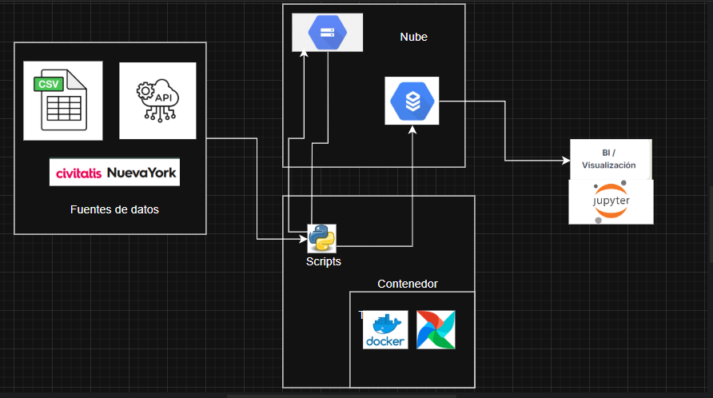
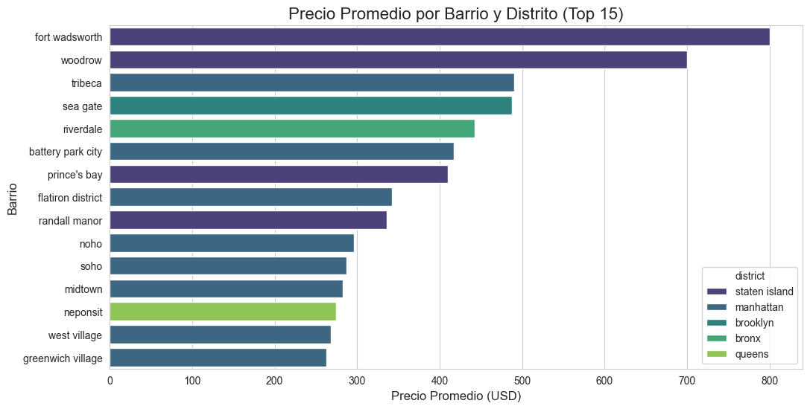
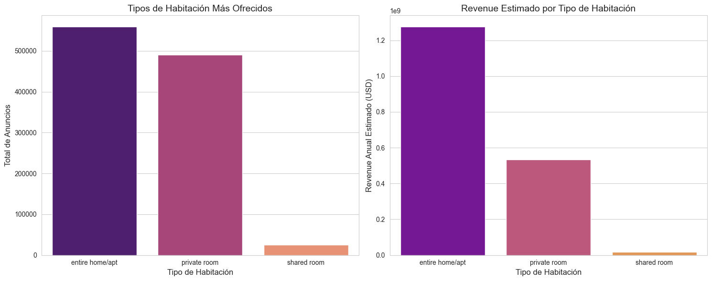
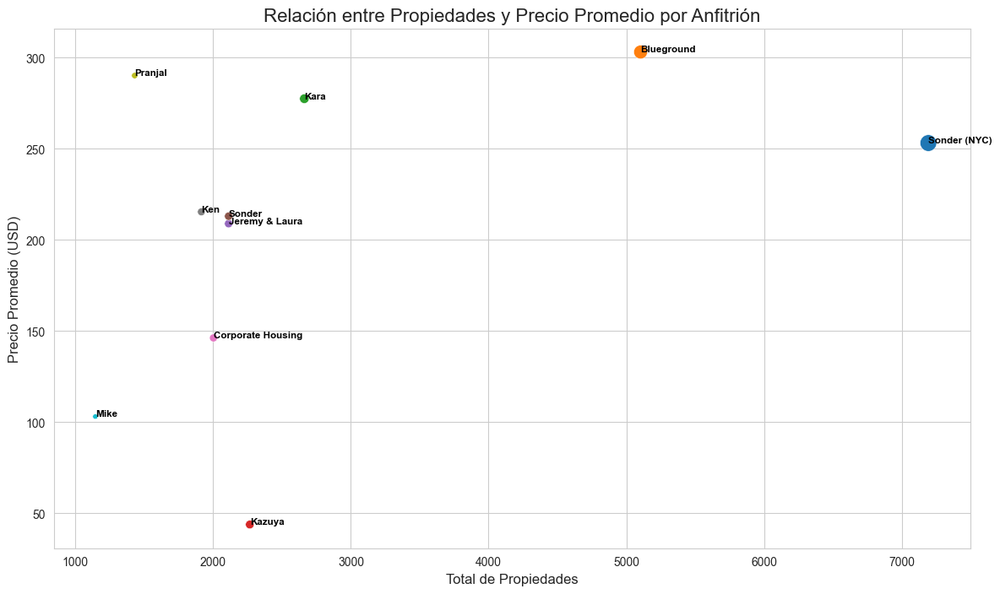
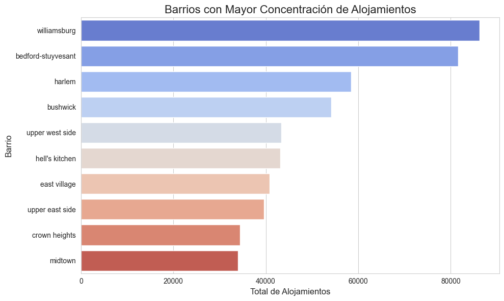
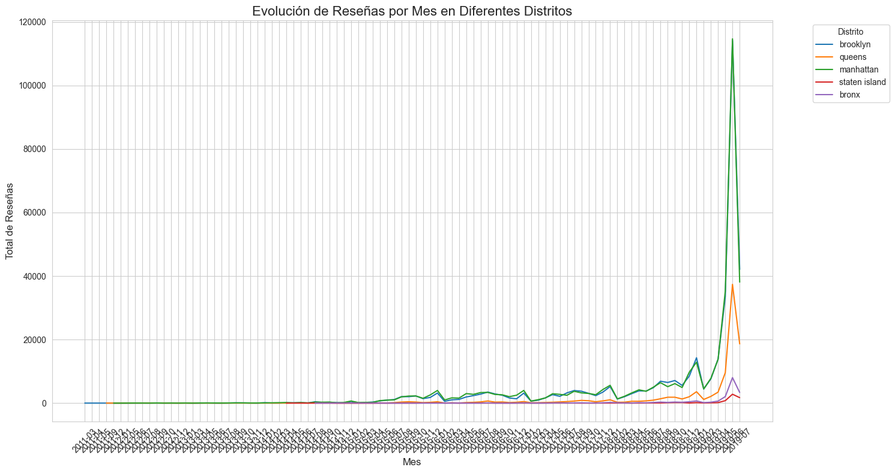

# Pipeline de Datos ELT con Apache Airflow, dbt y Docker

## Resumen del Proyecto

Este proyecto implementa un pipeline de datos de tipo **ELT** (Extraer, Cargar, Transformar) utilizando un stack de tecnologías moderno y escalable. El objetivo principal es extraer datos de diversas fuentes, cargarlos en una base de datos relacional y transformarlos con `dbt` para crear modelos de negocio, listos para análisis y visualización.

El orquestador principal del pipeline es **Apache Airflow**, que gestiona y monitorea cada una de las tareas. Las transformaciones se realizan con **dbt (data build tool)**, y todo el entorno se ejecuta en contenedores de **Docker**, garantizando un ambiente de desarrollo consistente y reproducible.

## Ejecución del DAG en Airflow
Una vez que el entorno de Docker esté activo y Airflow esté en funcionamiento, puedes ejecutar el pipeline siguiendo estos pasos:

1. Accede a la UI de Airflow: Abre tu navegador y navega a la URL donde se ejecuta el Airflow Webserver (por defecto, http://localhost:8085).

2. Habilita el DAG: En la página principal de DAGs, busca el DAG llamado full_elt_pipeline. Verás que está deshabilitado por defecto. Haz clic en el interruptor para habilitarlo.

3. Ejecución Manual: Para iniciar una ejecución manual del pipeline, haz clic en el botón de "Play" (Run DAG) en la fila del DAG.

4. Ejecución Automática: El DAG está configurado para ejecutarse automáticamente todos los días a las 9 AM (hora UTC), según lo definido por el parámetro schedule en el código del DAG.

5. Monitoreo: El DAG comenzará a ejecutarse y podrás monitorear el estado de cada tarea en la vista de gráfico (Graph View) para ver cómo se ejecuta de principio a fin.

## Arquitectura del Pipeline

El proceso sigue un modelo ELT, que se diferencia del ETL tradicional al realizar las transformaciones dentro de la base de datos de destino. Este enfoque permite aprovechar la potencia de la base de datos para las transformaciones.



1.  **Extracción de Datos:** Se consumen datos de diversas fuentes (APIs y web scraping) en scripts de Python.
    * API de BRCA: https://api.bcra.gob.ar/estadisticascambiarias/v1.0/Cotizaciones
    * Web scraping: https://www.nuevayork.net/museos, https://www.nuevayork.net/monumentos-atracciones
    * CSV local: data/AB_NYC.csv
2.  **Carga :** Los datos extraídos se cargan en un *bucket* de **Google Cloud Storage (GCS)**, que funciona como una zona de aterrizaje para los datos brutos.
3.  **Carga a MySQL:** Los datos se transfieren desde GCS a una base de datos **MySQL**, manteniendo su formato original.
4.  **Transformación:** **dbt** toma el control y ejecuta modelos SQL en MySQL para limpiar, modelar y enriquecer los datos.
5.  **Análisis:** Los modelos de dbt se consumen desde un **Jupyter Notebook** para realizar análisis exploratorio y crear visualizaciones de negocio.
6.  **CI/CD:**  Mediante **GitHub Actions** para la integración continua y la ejecución de pruebas.

## Estructura del Proyecto

El proyecto está organizado de manera modular, con cada carpeta cumpliendo un rol específico:
```
.
├── airflow/
│   └── dags/              # Archivos DAG de Airflow para la orquestación
│       └── full_elt_pipeline.py
├── data/                  # Datos crudos de ejemplo (no forma parte del pipeline)
├── dbt_profiles/          # Perfiles de conexión de dbt (profiles.yml)
├── logs/                  # Logs generados por Airflow
├── src/                   # Módulos de Python para la lógica del pipeline
│   ├── extraction/        # Scripts de extracción de datos
│   ├── load/              # Scripts de carga de datos
│   └── transformation/    # Scripts de transformación
├── graphics/              #Visualizaciones de respuestas a preguntas de negocio
├── requirements.txt       # Archivo de dependencias
├── docker-compose.yml     # Definición de servicios de Docker
├── Dockerfile             # Instrucciones para la construcción de la imagen de Docker
└── readme.md              # Este archivo

```

## Guía Paso a Paso: El Proceso de Construcción

Este `README` detalla el proceso que construimos juntos para crear este pipeline.

### Paso 1: Configuración del Entorno y Resolución de Problemas

Configuramos las variables de entorno en el archivo `.env` y definimos los servicios de **Airflow (webserver y scheduler)** en el `docker-compose.yml`. Con el respectivo Dockerfile

### Paso 2: La Orquestación con Apache Airflow

Construimos el DAG (`full_elt_pipeline.py`)[full_elt_pipeline.py](airflow/dags/full_elt_pipeline.py) en Airflow para orquestar cada tarea del pipeline.

* **Extracción de Datos:** Tareas como `extract_data_from_sources` se definen con `PythonOperator`, que ejecuta los scripts de la carpeta `src/`. Estos scripts se encargan de extraer los datos de las fuentes y cargarlos en GCS (`extract_data.py`)[extract_data.py](src/extraction/extract_data.py) este llama a (`validate_and_load_to_gcs`)[validate_and_load_to_gcs](src/load/validate_and_load_gcs.py) que valida y carga los datos en GCS.
* **Carga de Datos:**  (`load_raw_data_to_mysql`)[`load_data`](src/load/load_data.py) gestiona el flujo de datos desde la fuente hasta la base de datos, asegurando que el proceso se ejecute de manera secuencial y con éxito.

### Paso 3: Transformación con dbt

Una vez que los datos crudos están en MySQL, usamos `dbt` para transformarlos en una estructura limpia y optimizada para el análisis. La transformación se divide en tres capas principales:

* **Capa Staging (`stg_*.sql`)**: La primera capa de transformación. Los modelos de staging toman los datos brutos y los limpian, renombrando columnas, estandarizando formatos etc.
* **Capa Intermedia (`int_*.sql`)**: En esta capa, unimos y enriquecemos los datos de la capa de staging. Creamos una vista central, `int_listings_with_metrics`, que contiene todas las métricas y atributos necesarios para los análisis futuros.
Tambien se crea una vista central, `int_all_attractions`, que contiene todas las atracciones.
* **Capa de Data Marts (`dm_*.sql`)**: La capa final. Estos modelos están diseñados para responder preguntas de negocio específicas. 
Por ejemplo, `dm_listings_by_location` consolida el precio promedio por barrio y distrito, mientras que `dm_listings_by_room_type` analiza los ingresos estimados por tipo de habitación.
Luego tenemos `dm_listings` que es la tabla central de hechos. Presenta cada listado con todas sus métricas enriquecidas, sin agregaciones, lista para el análisis exploratorio, la identificación de outliers y la visualización.
Tambien tenemos `dm_listings_by_host` que resume las métricas a nivel de anfitrión, como el total de propiedades y la variación de sus precios.


### Paso 4: Exploración y Análisis de Datos con Jupyter

Una vez que los modelos de dbt están listos, el Jupyter Notebook se convierte en la herramienta principal para la exploración y el análisis.

* **Conexión y Consulta**: El notebook se conecta a la base de datos MySQL y ejecuta consultas SQL directamente sobre los modelos de Data Mart.
(`view.ipynb`)[view.ipynb](ghapics/view.ipynb) Usamos las librerías `pandas`, `seaborn` y `matplotlib` para generar gráficos que responden a preguntas de negocio como:
* **Visualización**: Usamos las librerías `pandas`, `seaborn` y `matplotlib` para generar gráficos que responden a preguntas de negocio como:
    * ¿Cuál es el precio promedio de los alojamientos por barrio y distrito?
        * 
        * Análisis: Se puede apreciar que el distrito con los precios más altos Staten Island. Con esto se podria decir que el distrito más caro para hospedarse. Y tambien se puede observar que en Manhattan hay más alojamientos los precios son mas bajos
    * ¿Qué tipo de habitación es el más ofrecido y cuál genera mayor revenue estimado?
        * 
        * Análisis: Podemos apreciar en el grafico que 'Apartamentos/Casas Enteras' y las 'Habitaciones Privadas' tienen una cantidad similar en cuanto a lo que se ofrecen, pero los apartamentos enteros generan un revenue estimado significativamente mayor. Esto indica que son más caros o tienen una mayor tasa de ocupación.
    * ¿Cuáles son los anfitriones con más propiedades listadas y cómo varían sus precios?
        * 
        * Análisis: Podemos observar que el mercado no está atomizado si no mas bien hay una dispercion
    * ¿Qué barrios tienen la mayor concentración de alojamientos activos?
        * 
        * Análisis: Podemos observar que el barrio con mayor concentración de alojamientos es el de Williamsburg
    * ¿Cómo evoluciona el número de reseñas por mes en los diferentes distritos?
        * 
        * Análisis: Podemos observar que el distrito de Manhattan tiene un aumento significativo en el número de reseñas, pero el de Staten Island no.
